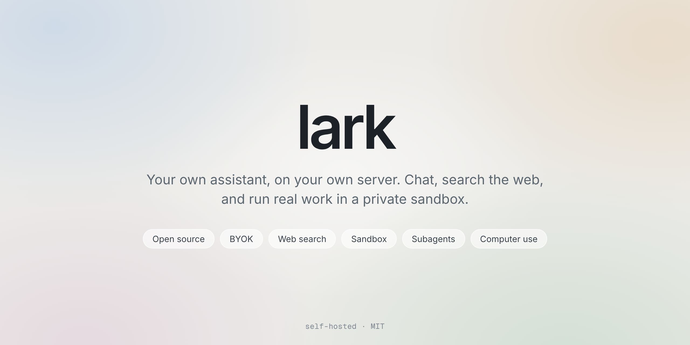

<p align="center"></p>

# Lark

An open source, self-hosted personal assistant. Chat with a model of your choice, through OpenRouter or Vercel AI Gateway. It can search the web, run commands in a private sandbox, and hand work to subagents.

> **Heads up:** Lark is an early, initial implementation. It may be buggy and is not feature complete. Expect rough edges, and review what it can do (commands, browsing, files) before trusting it with anything important. Persistent memory and Telegram are next.

## Run it

```sh
cd web && npm install && npm run build
cd ../server && pip install -r requirements.txt
python -m uvicorn lark.main:app --host 127.0.0.1 --port 8000
```

Open http://localhost:8000, go to Settings, and paste an API key.

For development, run the command above and `npm run dev` in `web/` (it proxies `/api` to port 8000).

## Security

- API keys are encrypted with Fernet and stored in `data/`. They are never sent back to the browser.
- The encryption key lives in `data/secret.key`, or set `LARK_SECRET_KEY` to keep it off the disk.
- Without `LARK_PASSWORD` the app only answers on `localhost`. To put it on a server, set `LARK_PASSWORD`, serve it over HTTPS and set `LARK_SECURE_COOKIE=1`. Five wrong passwords in ten minutes pause logins for five minutes.

## Deploy

On a Linux server with Python 3.11+, Node 22 and nginx. The files in `deploy/` are templates.

```sh
useradd --system --home /var/lib/lark --shell /usr/sbin/nologin lark
git clone https://github.com/omni-gh549/lark /opt/lark
cd /opt/lark/web && npm ci && npm run build
cd ../server && python3 -m venv .venv && .venv/bin/pip install -r requirements.txt

install -d -m 700 /etc/lark
printf 'LARK_PASSWORD=%s\nLARK_SECURE_COOKIE=1\nLARK_DATA=/var/lib/lark\n' "$(openssl rand -base64 24 | tr -d '+/=')" > /etc/lark/lark.env
chmod 600 /etc/lark/lark.env

cp /opt/lark/deploy/lark.service /etc/systemd/system/ && systemctl enable --now lark
```

Lark listens on `127.0.0.1:8790`. Put nginx in front (`deploy/nginx.conf`) and get a certificate with `certbot --nginx`. Until then, reach it with `ssh -L 8790:localhost:8790 your-server`.

To update: `git pull`, rebuild `web`, `systemctl restart lark`. Keys and settings are in `/var/lib/lark`; back that up.

## Tools

Lark can use tools. Each one switches on when its backend is set up, so a fresh install is just chat.

**Web search.** Open Settings, choose Brave Search or Tavily, and paste a key. Lark then searches when it needs to, and the chat shows each search as it happens.

**Sandbox.** A private Linux machine Lark can run commands in, with files that persist between chats. It is a Docker container with its own network, no access to the host, memory/CPU/process limits, and dropped capabilities. Set it up on a Linux server with Docker (as root):

```
cd /opt/lark/sandbox
./sandbox.sh up                    # builds the image, starts the container, writes LARK_SANDBOX_* to /etc/lark/lark.env
./sandbox-firewall.sh install      # blocks the sandbox from the host and private networks (internet stays open)
systemctl restart lark
```

**Browser.** If the sandbox image includes Chromium (it does when built with `sandbox.sh up`), Lark can also drive a real browser: open pages, read them, click and type by element number. The browser shuts itself down after 5 idle minutes, since it is the biggest memory user (budget 300 to 500 MB).

**Subagents.** When any tool is available, Lark can hand tasks to subagents (up to 4 at once) that work with the same tools and report back.

`./sandbox.sh reset` wipes the sandbox back to a clean image (Settings has a Reset everything button for this; `sandbox.sh up` installs a small systemd path unit so the unprivileged Lark service can ask for it without Docker access), `./sandbox.sh nuke` removes it. Settings has a button to clear its files without touching the container. Limits are `SANDBOX_MEM`, `SANDBOX_SWAP` (memory plus swap in total), `SANDBOX_CPUS` and `SANDBOX_PIDS` (defaults 1g, same as memory, 1, 256), read from the environment or `/etc/lark/lark.env`, so a reset keeps them. The browser wants roughly 500 MB.

Anything inside the sandbox can use your server's internet connection, so treat it as a shared box rather than a vault: never put secrets in it. The exec agent listens only on `127.0.0.1:8791` and needs the token in `LARK_SANDBOX_TOKEN`.

Chats are saved on the server in `data/chats/` (one JSON file each), so they follow you across devices. Replies run on the server too, so leaving the page or switching chats doesn't stop one; open the chat again and it picks up where it is. A server restart does interrupt a reply in progress. Update order on a server: `git pull`, `systemctl restart lark`, then rebuild `web` (so a new page never meets an old server).

## Tests

```sh
python server/tests/test_api.py
```

## License

MIT
